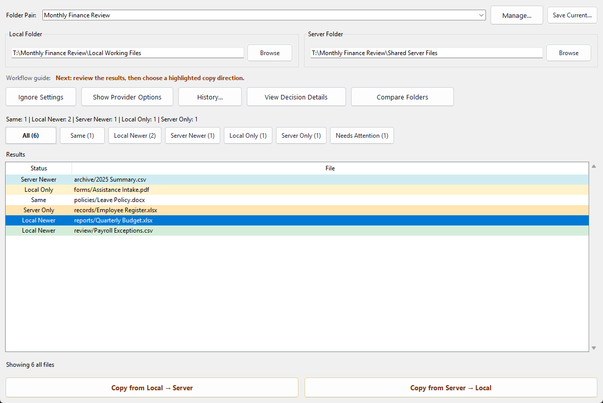
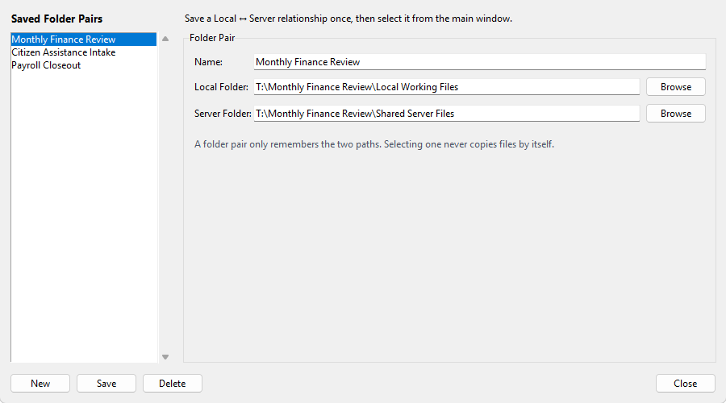
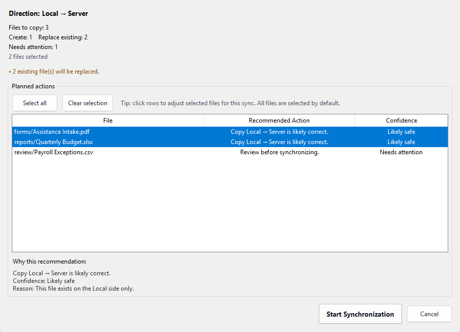
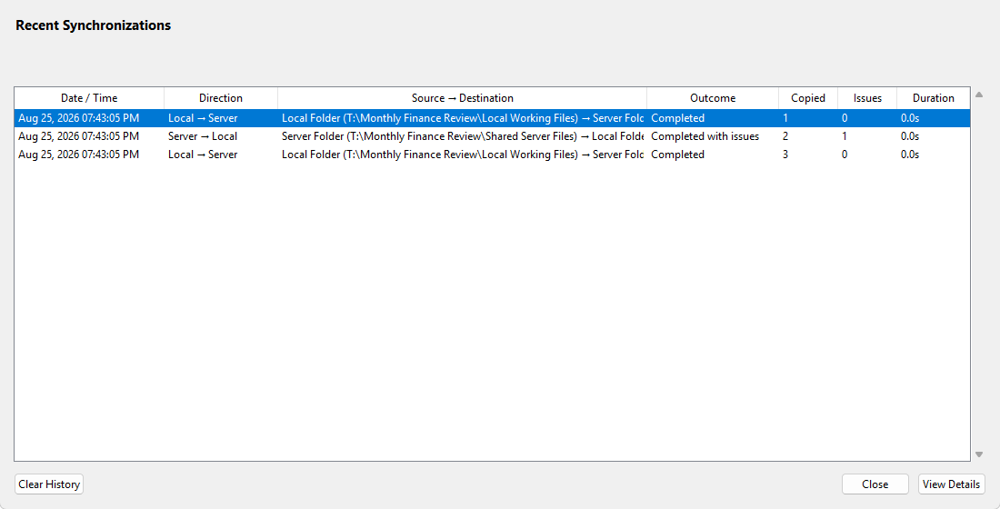

# TraceSync

TraceSync is a Windows desktop utility for safely comparing and synchronizing two folders. It is designed for office and shared-file environments where users must understand a copy operation before it changes a file.

Current release: **v0.10.0**

This release builds on the merged v0.9.1 baseline and adds Saved Folder Pairs for recurring Local ↔ Server relationships. The existing one-comparison-at-a-time workflow is unchanged, and planning-only provider controls remain hidden by default. The application version is read from the canonical `VERSION` resource in both source and packaged runtimes.

Development status: the current post-v0.10 branch implements Backup Before Overwrite. The tagged v0.10.0 release remains the latest release; no unreleased version number has been assigned.

## Workflow

```text
Compare -> Review results -> Select direction -> Preview -> Confirm -> Synchronize -> Summary -> Review history
```

TraceSync only performs one-way synchronization. It does not automatically resolve conflicts or schedule background runs.

## v0.10.0 product tour

The following captures come from the tagged v0.10.0 release and use representative office documents. They show the released workflow only; post-v0.10 backup work is not depicted or claimed here.

### Confidence-aware comparison



**What it does:** Classifies same, newer, and one-sided files, then isolates ambiguous metadata under **Needs Attention**.

**What it guarantees or avoids:** Comparing is read-only. It does not copy, replace, or delete files, and it does not guess a direction for the operator.

### Saved Folder Pairs



**What it does:** Remembers named Local ↔ Server relationships for recurring workflows without repeated folder browsing.

**What it guarantees or avoids:** Selecting a pair only fills the two paths. It never starts a comparison or synchronization by itself, and changing an endpoint clears stale results.

### Selective synchronization preview



**What it does:** Shows the one-way direction, creates, replacements, warnings, per-file recommendations, and confidence before execution. Operators can exclude individual files.

**What it guarantees or avoids:** No job starts without explicit confirmation. Approved files are revalidated immediately before copying, so metadata changed after preview causes a safe skip instead of a blind overwrite.

### Durable synchronization history



**What it does:** Records direction, outcome, copied totals, issues, duration, and structured per-file results for each run.

**What it guarantees or avoids:** Changed, skipped, or failed files are not reported as successful copies. Interrupted records are recovered honestly when completion cannot be proven.

> **Scope boundary:** v0.10.0 does not provide automatic synchronization, active cloud providers, bidirectional conflict resolution, backup, or rollback.

## Features

- Recursive folder scanning and relative-path comparison.
- Clear statuses: Local Newer, Server Newer, Same, Local Only, and Server Only.
- Color-coded and filterable result list, with file details on double-click.
- Named Folder Pairs for quickly switching between recurring Local ↔ Server relationships.
- A Folder Pair manager for creating, editing, renaming, and deleting saved relationships.
- Color-coded next-step guidance and hover help for the main folder and synchronization controls.
- Result-row context actions for opening file details and copying a relative path.
- Local -> Server and Server -> Local synchronization previews.
- Optional per-file selection in the synchronization confirmation preview.
- Explicit confirmation showing new files, replacements, and warnings.
- Background file copying with responsive progress, elapsed and estimated remaining time, and safe cancellation between files.
- File-level error reporting; recoverable errors do not stop other approved copies.
- Metadata validation immediately before each copy. Files changed after confirmation are skipped and require a new comparison.
- Required pre-overwrite backups in application-managed local storage; a failed backup blocks that file's overwrite.
- Atomic destination replacement so a failed or interrupted file copy does not leave a partial destination file.
- Durable synchronization history with structured run and per-file outcomes, interrupted-run recovery, and a newest-500-run retention limit.
- History review, backup restore, and selected-run CSV export, including spreadsheet formula-injection protection.
- A lightweight operating-system lock that permits only one active synchronization per user profile.
- JSON settings that retain selected folders, saved Folder Pairs, the active pair, and future provider-specific settings.
- Collapsible, planning-only provider selections and status messaging; these are hidden by default and do not connect to or move data through remote services.

## Safety model

TraceSync never starts a synchronization job until the user confirms the complete preview and the initial `in_progress` history record is safely persisted. Existing destination files are identified before confirmation. Each approved overwrite first creates and verifies a backup under `%LOCALAPPDATA%\TraceSync\backups\`; if that backup fails, the existing destination is left unchanged. The replacement is staged beside the destination and committed atomically. New-file copies do not create unnecessary backups.

History details identify files with backups and provide a confirmed Restore action. Restore first saves the current destination as another safety backup. Automatic retention keeps at most two versions per destination file, up to 5 GB of valid backup content globally and 500 valid entries overall. The oldest eligible backups are removed first, while the backup required by the active operation is protected. These backups protect against logical overwrites; because they remain on the same computer by default, they are not a substitute for an independent disaster-recovery backup.

If the final history update fails after copying, TraceSync preserves the real synchronization result and warns the user. The durable record remains `in_progress`; on a later launch it is honestly classified as `interrupted` because completion cannot be proven from the history store.

The tagged v0.10.0 release did not include backup or restore; those capabilities are under development on this branch. Automatic synchronization, active cloud providers, and bidirectional conflict resolution remain out of scope.

## Architecture

```text
MainWindow
  -> FolderPairManagerDialog -> SettingsService
  -> SyncService
     -> StorageScanner -> StorageProvider
     -> comparer -> ComparisonResult
     -> SyncPreview -> SyncJobRunner -> SyncJob
     -> BackupService -> JsonBackupStore
     -> SyncHistoryService -> JsonSyncHistoryStore
```

`LocalStorageProvider` is the only concrete provider. The provider abstraction keeps scanning and synchronization independent of the local filesystem API, ready for later storage backends without changing the UI workflow. Folder Pair persistence remains a UI/settings concern and does not alter comparison or synchronization logic.

See [Architecture](docs/ARCHITECTURE.md) for module responsibilities, [Roadmap](docs/ROADMAP.md) for completed commitments and current status, and the [v0.1-v0.9.1 Retrospective](docs/RETROSPECTIVE_V0.1_V0.9.1.md) for the reconciled product history. Future possibilities remain separately classified in the [Backlog](docs/BACKLOGS.md) and [Icebox](docs/ICEBOX.md); neither is a development commitment.

## Running locally

TraceSync requires Python 3 and Tkinter.

```powershell
python main.py
```

Run the automated synchronization tests with:

```powershell
python -m unittest discover -s tests -v
```

## Project layout

```text
core/       comparison, providers, synchronization, backup/restore, history, and CSV export
models/     lightweight comparison, synchronization, backup, and history dataclasses/enums
ui/         Tkinter window and dialogs, including history review
utils/      settings and application-version utilities
tests/      synchronization, persistence, export, and UI behavior tests
docs/       vision, roadmap, retrospective, architecture, backlog, and icebox
```
